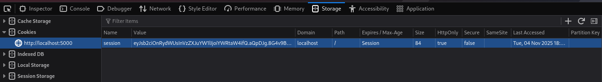
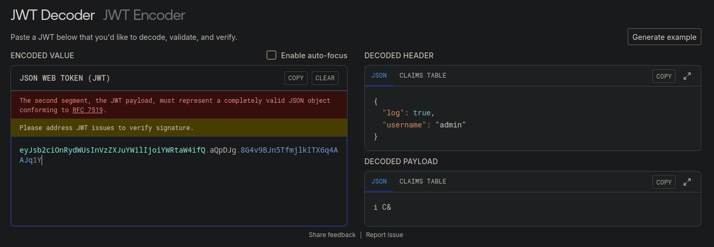
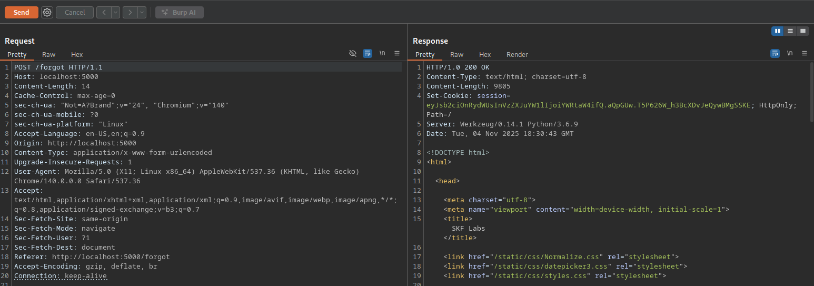

### session ouzzling
```bash
docker pull blabla1337/owasp-skf-lab:sessionpuzzle

docker run -dit -p 127.0.0.1:5000:5000 blabla1337/owasp-skf-lab:sessionpuzzle

```
- cookie session


- jwt


```bash
eyJsb2ciOnRydWUsInVzZXJuYW1lIjoiYWRtaW4ifQ.aQpDJg.8G4v9BJn5TfmjlkITX6q4AAJq1Y

```
- forgot pass


```bash
HTTP/1.0 200 OK
Content-Type: text/html; charset=utf-8
Content-Length: 9805
Set-Cookie: session=eyJsb2ciOnRydWUsInVzZXJuYW1lIjoiYWRtaW4ifQ.aQpGUw.T5P626W_h3BcXDvJeQywBMgSSKE; HttpOnly; Path=/
Server: Werkzeug/0.14.1 Python/3.6.9
Date: Tue, 04 Nov 2025 18:30:43 GMT

<!DOCTYPE html>
<html>

<head>

	<meta charset="utf-8">
	<meta name="viewport" content="width=device-width, initial-scale=1">
	<title>SKF Labs</title>
```

